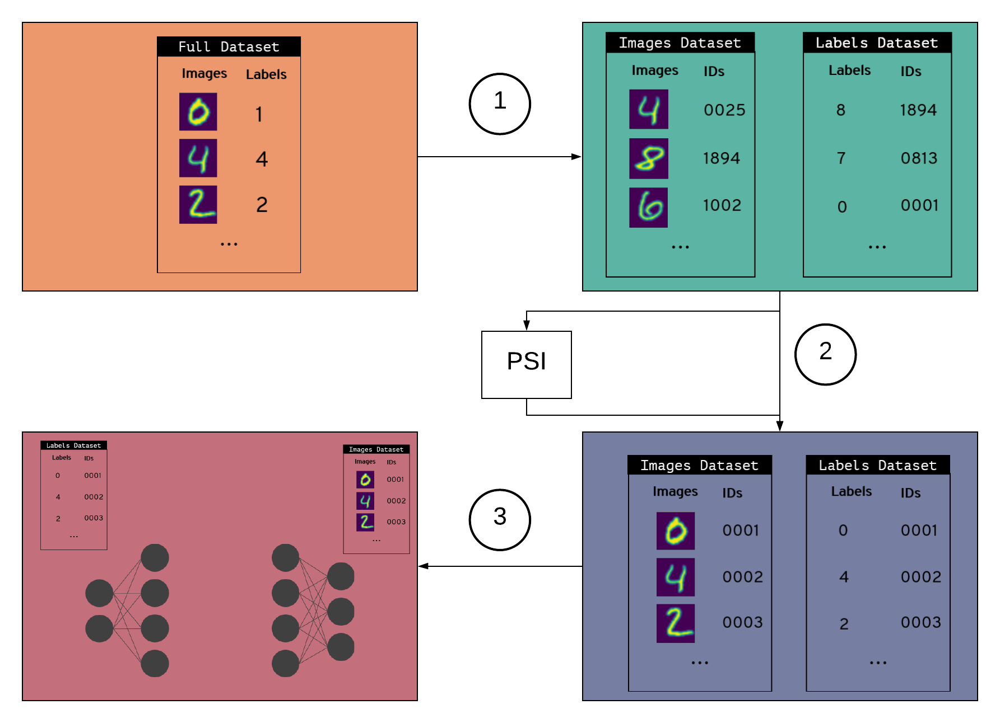

# PyVertical

A project developing Privacy Preserving Vertically Distributed Learning.

- :lock: Links vertically partitioned data
         without exposing membership
         using Private Set Intersection (PSI)
- :eye: Trains a model on vertically partitioned data
        using SplitNNs,
        so only data holders can access data




PyVertical process:
1. Create partitioned dataset
    - Simulate real-world partitioned dataset by splitting MNIST into a dataset of images and a dataset of labels
    - Give each data point (image + label) a unique ID
    - Randomly shuffle each dataset
    - Randomly remove some elements from each dataset
1. Link datasets using PSI
    - Use **PSI** to link indices in each dataset using unique IDs
    - Reorder datasets using linked indices
1. Train a split neural network
    - Hold both datasets in a dataloader
    - Send images to first part of split network
    - Send labels to second part of split network
    - Train the network

## Requirements
This project is written in Python.
The work is displayed in jupyter notebooks.

To install the dependencies,
we recommend using [Conda]:
1. Clone this repository
1. In the command line, navigate to your local copy of the repository
1. Run `conda env create -f environment.yml`
    - This creates an environment `pyvertical-dev`
    - Comes with most dependencies you will need
1. Activate the environment with `conda activate pyvertical-dev`
1. Run `pip install syft[udacity]`
1. Run `conda install notebook`

N.b. Installing the dependencies takes several steps to circumvent versioning incompatibility between
`syft` and `jupyter`.
In the future,
all packages will be moved into the `environment.yml`.

## Usage
To create a vertically partitioned dataset:
```python
from torchvision.datasets import MNIST
from torchvision.transforms import ToTensor

from src.dataloader import PartitionDistributingDataLoader
from src.dataset import add_ids, partition_dataset

# Create dataset
data = add_ids(MNIST)(".", download=True, transform=ToTensor())  # add_ids adds unique IDs to data points

# Split data
data_partition1, data_partition2 = partition_dataset(data)

# Batch data
dataloader = PartitionDistributingDataLoader(data_partition1, data_partition2, batch_size=128)

for (data, ids1), (labels, ids2) in dataloader:
    # Train a model
    pass
```

## Contributing
Pull requests are welcome.
For major changes,
please open an issue first to discuss what you would like to change.

Read the OpenMined
[contributing guidelines](https://github.com/OpenMined/.github/blob/master/CONTRIBUTING.md)
and [styleguide](https://github.com/OpenMined/.github/blob/master/STYLEGUIDE.md)
for more information.

## Contributors
|  [][ttitcombe] | [][pavlos-p]  | [][h4ll]
| :--:|:--: |:--:|
|  [TTitcombe] | [Pavlos-p]  | [H4LL]

## Testing
We use [`pytest`][pytest] to test the source code.
To run the tests manually:
1. In the command line, navigate to the root of this repository
1. Run `python -m pytest`

CI also checks the code conforms to [`flake8`][flake8] standards
and [`black`][black] formatting

## License
[Apache License 2.0](https://choosealicense.com/licenses/apache-2.0/)

[black]: https://black.readthedocs.io/en/stable/
[conda]: https://docs.conda.io/en/latest/
[flake8]: https://flake8.pycqa.org/en/latest/index.html#quickstart
[pytest]: https://docs.pytest.org/en/latest/contents.html

[ttitcombe]: https://github.com/ttitcombe
[pavlos-p]: https://github.com/pavlos-p
[h4ll]: https://github.com/h4ll